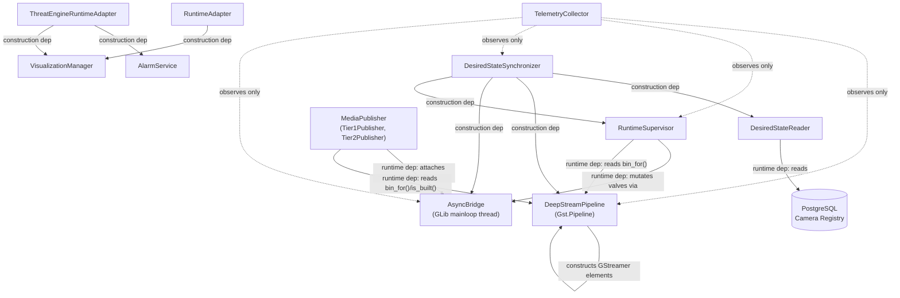

# Camera Runtime v1 — Production Startup & Component Lifecycle

Internal engineering reference. Describes the production runtime exactly
as it exists today (`apps/deepstream/app/main.py` → `DeepStreamRuntime` in
`apps/deepstream/app/runtime.py`), after Camera Runtime v1 (RM-12 Steps
1–7) was wired into production and the `remove_source()` pad-lifecycle
defect was fixed. Not user documentation — this is the "read this instead
of the source" document for a new engineer joining the subsystem.

---

## 1. Startup Sequence

Two phases: process bootstrap (`main.py`, before `DeepStreamRuntime`
exists), then `DeepStreamRuntime`'s own construction and `start()`.

### 1.1 Process bootstrap (`main.py`)

1. **Configuration** — load API settings, DeepStream settings, models,
   validation, visualization (each its own cached loader).
2. **Logging** — `configure_logging()` (structured JSON to stdout) and
   `configure_stage_logging()` (the 17 `radar_eye.stage.*` loggers).
   Logging must exist before anything below can usefully log.
3. **Database** — engine + async session factory.
4. **Credential encryption provider** — needed to decrypt RTSP
   credentials Desired State Synchronization will read.
5. **EventBus** (`InProcessEventBus`) and **HealthCollector** — shared
   in-process singletons this OS process's components publish to /
   report through.
6. **Construct `DeepStreamRuntime`** — triggers the full construction
   sequence in §1.2 below.
7. **`set_health_collector()`** — injects the HealthCollector built in
   step 5 (a setter, not a constructor arg, so `runtime.py` never
   hard-imports `apps.api`).
8. **Signal handlers** (SIGINT/SIGTERM → `stop_event`).
9. **`await runtime.start()`** — see §1.3.

### 1.2 `DeepStreamRuntime.__init__` construction order

Every component below is *constructed* here; almost nothing touches
GStreamer yet (`DeepStreamPipeline.build()` hasn't run). Order matters
because later constructors take earlier objects as dependencies:

| # | Component | Depends on (already built) |
|---|---|---|
| 1 | `HeartbeatRegistry` | — |
| 2 | `PipelineTracer` | — |
| 3 | `VisualizationManager` | settings only (always constructed, regardless of `visualization.enabled`) |
| 4 | `PerformanceInstrumentation` | models settings |
| 5 | `RuntimeAdapter` | bus, instrumentation, heartbeat, tracer |
| 6 | `AlarmService` | bus |
| 7 | `ThreatEngineRuntimeAdapter` | bus, alarm service, heartbeat, tracer, instrumentation, `VisualizationManager.track_annotations` |
| 8 | `FrameCounter` | — |
| 9 | `AsyncBridge` | the asyncio loop (not started yet) |
| 10 | `DeepStreamPipeline` | frame counter, instrumentation, heartbeat, visualization settings/manager, `media_publisher_enabled=True` |
| 11 | `RuntimeSupervisor` | pipeline, bridge, `ConcurrentEnableLimiter` |
| 12 | `MediaPublisher` | pipeline, bridge |
| 13 | `pipeline.set_tier2_publisher(media_publisher.tier2)` | breaks a circular dependency — see §2 |
| 14 | `DesiredStateReader` | session factory, encryption |
| 15 | `DesiredStateSynchronizer` | reader, pipeline, bridge, runtime supervisor |
| 16 | `TelemetryCollector` | pipeline, runtime supervisor, synchronizer, bridge, instrumentation |

**Why this order**: each row only needs objects that already exist —
there is no forward reference except one, `MediaPublisher` ↔
`DeepStreamPipeline` (row 10 needs `media_publisher_enabled=True` before
`MediaPublisher` exists at row 12, and `MediaPublisher` needs the
already-built pipeline object). Resolved with `set_tier2_publisher()`, a
setter-for-a-not-yet-available-dependency, the same pattern
`set_health_collector()` uses one layer up. `TelemetryCollector` is built
last among the Camera Runtime v1 components because it only *observes*
the other three (§4) — it must never be a dependency anything else needs.

### 1.3 `DeepStreamRuntime.start()`

1. `pipeline.build()` — constructs the actual GStreamer graph
   (streammux → PGIE → tracker → SGIE, the shared SGIE tee if
   Visualization or Media Publisher is active, `nvstreamdemux` if Media
   Publisher is active). Pipeline is not yet PLAYING.
2. `bridge.start()` — spawns the GLib main-loop thread. From this point
   `AsyncBridge.schedule_on_mainloop()` is usable.
3. **Initial Desired State convergence** —
   `desired_state_synchronizer.synchronize()`: reads Camera Registry's
   Desired State from the database, adds a source per camera whose
   `lifecycle_state` is not `DISABLED` (Camera Connectivity is
   independent of lifecycle_state and `ai_enabled` -- Operator
   Acceptance Testing finding: a camera used to only connect once
   promoted all the way to `OPERATIONAL`, so registering a camera and
   having it connect were never the same step), then converges
   `ai_enabled` only for cameras that are both `ai_enabled=true` and
   `lifecycle_state == OPERATIONAL` (AI eligibility is unchanged from
   before this fix -- only the connectivity gate moved). Must run
   *before* the pipeline goes PLAYING so the first batch already reflects
   the correct source set.
4. Reconnect policy + `RuntimeAdapter.on_camera_connected()` for each
   camera now active.
5. `pipeline.start()` — sets the `Gst.Pipeline` to PLAYING. Frames begin
   flowing.
6. `HeartbeatScheduler` constructed (requires `set_health_collector()`
   to have already run) and started.
7. `telemetry.start()`.
8. Three background asyncio tasks launched: periodic performance
   sampling, periodic Telemetry snapshot logging, and the Desired State
   poll loop (§7).

---

## 2. Dependency Graph

- **Construction dependency** (solid, "construction dep"): the object
  must exist *before* this one's `__init__` can run — a one-time ordering
  constraint, not something checked again after startup.
- **Runtime dependency** (solid, "runtime dep"): this component calls the
  other's methods *while running*, not just at construction (e.g.
  `RuntimeSupervisor` calls `bridge.schedule_on_mainloop()` every time it
  mutates a valve).
- **Ownership**: not shown as edges here — see §3. Ownership is stronger
  than a dependency; it implies the owner is responsible for the
  resource's teardown.
- **Observation** (dashed): `TelemetryCollector` reads state from four
  components but calls no mutating method on any of them, and nothing
  reads from `TelemetryCollector` to make a decision — it is a pure leaf.

---

## 3. Resource Ownership

Exactly one owner per resource. Where a resource is *used* by more than
one component, only one of them tears it down.

| Resource | Owner | Notes |
|---|---|---|
| `Gst.Pipeline`, `nvstreammux`, PGIE/tracker/SGIE, SGIE tee, `nvstreamdemux` | `DeepStreamPipeline` | Built once in `build()`, torn down once in `stop()`. |
| Per-camera source bins (decoder, Tier 1 tee, AI valve) | `DeepStreamPipeline` | Built/destroyed per camera in `add_source()`/`remove_source()`. |
| `nvstreammux` sink request pads | `DeepStreamPipeline` | Requested once per camera_id, kept for the process's life, **never released** while running — only linked/unlinked (see §6). |
| `nvstreamdemux` src request pads | `Tier2Publisher` (inside `MediaPublisher`) | Same never-release rule, independently enforced for the same documented reason. |
| Tier 1 tee | `DeepStreamPipeline` (topology) / `Tier1Publisher` (attach/detach of consumers) | The tee element belongs to the source bin; *who is currently listening* to it is `Tier1Publisher`'s bookkeeping only. |
| AI valve | `RuntimeSupervisor` | The **only** component permitted to mutate valve state (§6). `DeepStreamPipeline` only exposes `bin_for()` so the valve can be located by name. |
| Runtime worker queues (per-camera command queue) | `RuntimeSupervisor` | Internal to its own `_CameraWorker`s. |
| `AsyncBridge` (GLib main-loop thread) | `DeepStreamRuntime` | Started/stopped once, shared by every component above that needs to reach the GLib thread. |
| Telemetry snapshot state | `TelemetryCollector` | Read-only derived state; owns nothing it didn't observe. |
| Tier 1 / Tier 2 consumer registries | `MediaPublisher` (`ConsumerRegistry` per tier) | Register/unregister is pure bookkeeping; attach/detach is the only part that touches real pads, via the bridge. |
| `FrameObservation` → detection metadata | `RuntimeAdapter` | The sole `pyds`-touching module for metadata extraction (ADR-027). |
| Threat assessment orchestration | `ThreatEngineRuntimeAdapter` | Owns the Calibration → Threat Engine → Incident/Alarm call chain per frame observation. |
| Alarm records | `AlarmService` | Long-lived singleton (in-memory `_records` state persists across escalations, unlike per-call `IncidentService`/`CalibrationService`). |
| Camera Desired State (`lifecycle_state`, `ai_enabled`, `recording_enabled`) | Camera Registry (API service, database) | `DeepStreamPipeline`/`RuntimeSupervisor` never write it — they only converge *toward* it, read-only via `DesiredStateReader`. |
| Camera Observed State (`status`, `fps`, `latency_ms`, `last_seen_at`, `reconnect_count`, `last_stream_error`) | `RuntimeAdapter` (connection-state fields, immediate) / `HeartbeatScheduler` via its `on_health_snapshot` hook (fps/latency, throttled) | The reverse boundary: Camera Registry never writes these columns. Persisted to Postgres directly from `apps.deepstream`, not routed through `apps.api`. |

If ownership looks shared (e.g. Tier 1 tee), it is because construction
and consumption are genuinely different responsibilities — the owner
that *tears down* the resource is always singular.

---

## 4. Runtime Responsibilities

**Camera Registry** (API service, outside this process). Owns Desired
State exclusively — `lifecycle_state`, `ai_enabled`, `recording_enabled`
— written only in response to an explicit operator action. Never touches
Camera Runtime directly; Camera Runtime *observes* it via
`DesiredStateReader`.

**Desired State Synchronizer**. The single point where Desired State
(Camera Registry) and Runtime State (this pipeline) become connected. A
reconciliation loop, not imperative execution: reads, diffs, dispatches
the minimal set of `add_source`/`remove_source`/`enable_ai`/`disable_ai`
actions. Owns no read path of its own and performs no pipeline mutation
directly for AI state — it decides *direction*, `RuntimeSupervisor`
converges it.

**Runtime Supervisor**. Per-camera command queue and serialized
dispatcher for `EnableAI`/`DisableAI`. The only component allowed to
mutate the AI valve. Idempotent (repeated identical commands are no-ops)
and GPU-admission-gated via a pluggable `ConcurrentEnableLimiter`. Every
mutation is scheduled through `AsyncBridge.schedule_on_mainloop()`.

**Source Manager** (`ingestion/source.py`). Builds one camera's decode
bin (`rtspsrc → depay → parse → decoder → Tier 1 tee → valve → ghost
pad`) and nothing else — no reconnect policy, no orchestration. The only
module in Camera Runtime that requires real Jetson/DeepStream hardware to
exercise.

**Frame Distributor**. The Tier 1 tee inside each source bin, positioned
between the decoder and the valve so the raw, pre-AI frame resource is
structurally independent of AI state — toggling AI never affects Tier 1.

**AI Runtime** (`ai_runtime/` package: `RuntimeAdapter` +
`ThreatEngineRuntimeAdapter`). Turns raw inference buffers into
`FrameObservation`s (the sole `pyds`-touching code, ADR-027), then routes
each observation to two independent consumers: instrumentation/logging
and threat assessment orchestration (Calibration → Threat Engine →
Incident/Alarm).

**Media Publisher**. Owns Tier 1 and Tier 2 consumer lifecycle
(register/unregister, attach/detach) behind one shared, failure-isolated
`ConsumerRegistry` per tier. Tier 2 exists only for AI-enabled cameras —
not by explicit check, but because the valve gates what ever reaches
`nvstreamdemux` in the first place. Ships with zero default subscribers;
a real transport is future work (§7).

**Telemetry**. Observational only — liveness, readiness, and metrics
derived from the four components above. Never writes back into any of
them; never influences a reconciliation decision.

**Visualization**. Renders directly from the existing pipeline's own
inference results (one fixed camera, RM-11.SIV scope) — no second
inference pass, no duplicate metadata extraction. Strictly read-only with
respect to detection/tracking metadata; writes only display-only fields.
A visualization failure can never take inference down with it.

**Reconnect Manager**. Not a separate class — reconnect orchestration
lives in `runtime.py` itself (deliberately, not in `ingestion/source.py`,
which only builds/tears down elements). A bus ERROR/EOS for a camera's
bin is detected on the GLib thread, backoff timing comes from that
camera's own `ReconnectPolicy` (one camera's failure state never touches
another's), and the rebuild is scheduled back onto the GLib thread.

---

## 5. Shutdown Sequence

`DeepStreamRuntime.stop()`, in this exact order:

1. Cancel the three background asyncio tasks (metrics, telemetry,
   Desired State poll loop) — stop anything that could still *trigger* a
   new pipeline mutation before touching what it would mutate.
2. `telemetry.stop()` — stop observing before anything being observed
   goes away, so no snapshot reads half-torn-down state.
3. `await media_publisher.shutdown()` — detach every Tier 1/Tier 2
   consumer while the bridge (needed for `schedule_on_mainloop`) is still
   alive.
4. `await runtime_supervisor.stop()` — cancel per-camera worker tasks
   while the bridge is still alive.
5. `heartbeat.stop()`.
6. `pipeline.stop()` — `VisualizationManager.stop()` first (RTSP server,
   then GStreamer elements, then the tee's release pad), then the
   `Gst.Pipeline` itself to `NULL`.
7. `bridge.stop()` — stop the GLib main-loop thread last, since nothing
   above needs it anymore.
8. `await alarm_service.stop()` — fail-safe shutdown (ADR-012/026), last.

**Why this order prevents specific failure classes**:

- *Dangling callbacks*: cancelling the poll/metrics/telemetry tasks
  first means nothing can call `schedule_on_mainloop()` after the bridge
  starts winding down.
- *Pad leaks / request-pad misuse*: `nvstreammux`/`nvstreamdemux` request
  pads are never released at all during normal operation (§6) — shutdown
  doesn't need to release them either; `Gst.Pipeline` → `NULL` tears down
  the whole element graph atomically.
- *Race conditions*: publishers and the supervisor are torn down while
  the bridge is still running, so their own teardown calls (which go
  through the bridge) don't hit `BridgeNotRunningError`.
- *Use-after-free*: this is the exact class of bug §6's pad-lifecycle
  invariant and the `remove_source()` fix exist to prevent — shutdown
  order alone doesn't substitute for it; the invariant does.
- *Publisher teardown issues*: `media_publisher.shutdown()` runs before
  `runtime_supervisor.stop()`, so no consumer is left attached to a valve
  the supervisor might otherwise still be mid-toggle on.

---

## 6. Operational Invariants

- `nvstreammux`/`nvstreamdemux` request pads are allocated once per
  camera_id and **never released** while the pipeline is running — only
  linked and unlinked. (Hardware-confirmed: dynamic release segfaulted
  the process; see the `remove_source()` fix.)
- `RuntimeSupervisor` is the only component allowed to mutate AI valve
  state.
- Desired State (`lifecycle_state`, `ai_enabled`, `recording_enabled`)
  is owned exclusively by Camera Registry; Camera Runtime only reads it.
- Camera Observed State (`status`, `fps`, `latency_ms`, `last_seen_at`,
  `reconnect_count`, `last_stream_error`) is owned exclusively by Camera
  Runtime; Camera Registry never writes it. Persisted to Postgres (not
  just tracked in-memory) since `apps.api` and `apps.deepstream` are
  separate processes and don't share memory -- `RuntimeAdapter` writes
  connection-state transitions immediately, event-driven, one write per
  transition; `HeartbeatScheduler`'s `on_health_snapshot` hook writes
  fps/latency at a deliberately coarser, configurable interval
  (`observed_state_flush_interval_seconds`, default 3s) to keep database
  write volume low -- never per-frame.
- Camera Connectivity is independent of `ai_enabled` and independent of
  `lifecycle_state` except `DISABLED`: every non-DISABLED camera gets an
  active source. AI eligibility is unchanged and remains its own,
  separate gate: `RuntimeSupervisor.enable_ai` only actually runs when
  `ai_enabled=true` **and** `lifecycle_state == OPERATIONAL`
  (`DefaultLifecycleSourcePolicy.should_have_active_source`/
  `.should_allow_ai` in `synchronization.py` -- two independent methods
  on one policy object, not one combined check).
- `DesiredStateSynchronizer` still owns calling `_ensure_source`/
  `_remove_source` directly (unchanged) -- only the *policy* deciding
  when to call them changed. Known gap, found during Operator Acceptance
  Testing hardware validation, not fixed here (out of scope -- requires
  its own design, not a "smallest correct change"): `runtime.py`'s
  `_schedule_reconnect`/`_reconnect` GLib-timeout retry loop has no exit
  condition tied to Desired State -- once a reconnect chain is in
  flight, transitioning the camera to `DISABLED` does not stop it. Track
  before relying on `DISABLED` to halt an in-flight reconnect storm
  against real hardware.
- Telemetry is observational only — it never feeds back into any
  reconciliation or valve decision.
- Tier 1 must remain structurally independent of AI state (its tee sits
  upstream of the valve).
- Tier 2 exists only for AI-enabled cameras, as a consequence of valve
  placement — not an explicit per-tier check.
- All pipeline mutations occur through `AsyncBridge` on the GLib main
  loop — no other module reaches across threads on its own.
- Publisher failures (Tier 1/Tier 2 consumer exceptions) must never
  propagate into the pipeline — dispatch is failure-isolated per
  consumer.
- Visualization failures must never take inference down with them
  (construction and start-up failures both funnel through one
  failure-isolation path, converted into a health status).
- One camera's reconnect/failure state never affects another camera's
  (`ReconnectPolicy` is per-camera).
- The Desired State poll loop (§1.3) skips a tick rather than allowing
  overlapping `synchronize()` calls.

---

## 7. Future Extension Points

These are the seams the current architecture already leaves open — not a
redesign, just where new work should attach:

- **Recording** — a new Tier 1 (and/or Tier 2) consumer registered with
  `MediaPublisher`, exactly like any other subscriber; no pipeline
  topology change needed.
- **RTSP/WebRTC streaming to the frontend** — likewise a new Tier 1/Tier
  2 consumer; Media Publisher was built with zero default subscribers
  specifically so a real transport can be added without touching the
  publisher lifecycle itself.
- **Event-driven Desired State updates** — replacing §1.3's temporary
  poll loop. `DesiredStateSynchronizer.synchronize()` already "takes no
  transport-specific arguments and is safe to call from anywhere" (its
  own docstring) — an EventBus subscription would call the same method,
  no synchronizer change required.
- **Cross-process EventBus (RM-14)** — today `apps.api` and
  `apps.deepstream` each construct an independent `InProcessEventBus`;
  unifying them is exactly what would make the event-driven option above
  possible across processes, not just in-process.
- **Health endpoints** — `TelemetryCollector` has no HTTP endpoint by
  design (RM-14 process-composition is still undecided); `snapshot()`/
  `liveness()`/`readiness()` are already pull-based and ready to be
  exposed once that decision is made.
- **Distributed deployments** — `RuntimeSupervisor`'s `GpuAdmissionHook`
  is already a pluggable interface (`ConcurrentEnableLimiter` is one
  implementation); a distributed admission policy would implement the
  same protocol, no call-site change.
